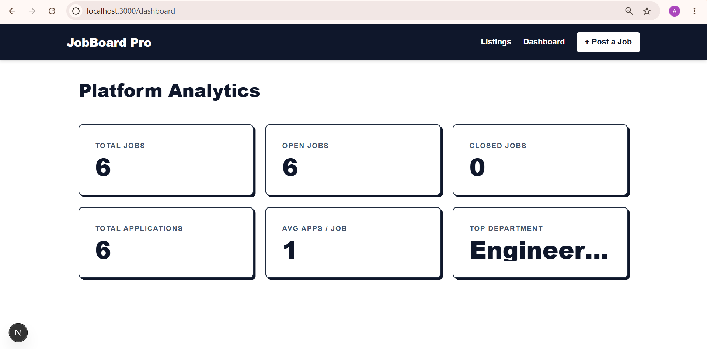
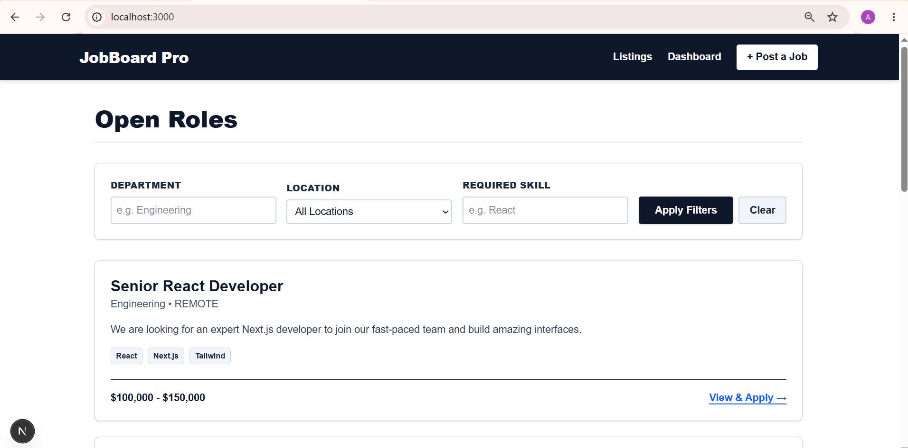
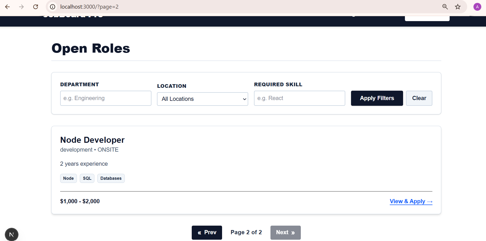
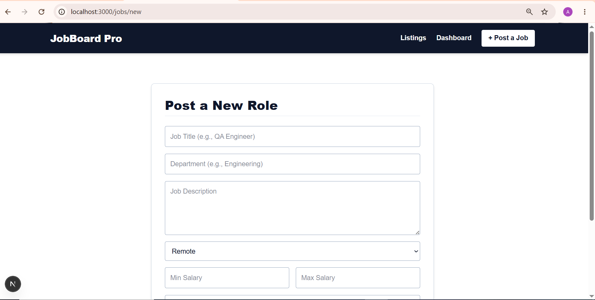
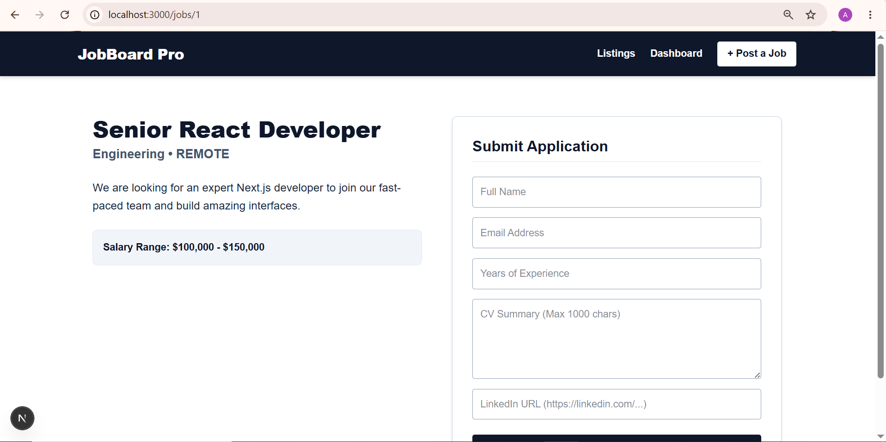
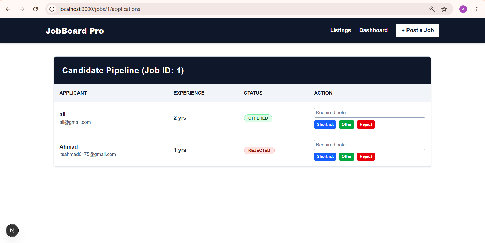
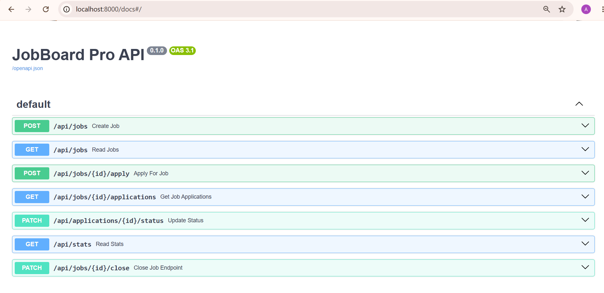

# JobBoard Pro

A full-stack job listing and application management platform built to handle the complete hiring lifecycle—from job posting to candidate pipeline management.

## 🚀 Tech Stack
* **Backend:** Python 3.14, FastAPI, SQLite, SQLAlchemy (ORM), Pydantic, Pytest
* **Frontend:** Next.js 15 (App Router), React, Tailwind CSS, TypeScript
* **Tooling:** `uv` (Python package manager), `npm`

## ✨ Core Features
* **Job Management:** Create, view, and manually close job listings.
* **Smart Search:** Browse open roles with simultaneous filtering by department, location, and skills, complete with pagination.
* **Applicant Tracking:** Submit applications with strict data validation, duplicate-email prevention, and maximum applicant caps.
* **Strict Hiring Workflow:** One-way status progression (Pending ➡️ Shortlisted ➡️ Offered) with mandatory manager notes and immutable history logging.
* **Real-Time Analytics:** A dynamic dashboard tracking total jobs, application averages, and top-performing departments.

---

## 🛠️ Developer Setup & Installation

### Prerequisites
- Python 3.14 (managed via `uv`)
- Node.js (v18+)

### Backend Setup
1. Navigate to the backend directory: 
   ```bash
   `cd backend`
Initialize the environment and install dependencies:

Bash
`uv init --python 3.14`
`uv pip install -r requirements.txt`
Activate the virtual environment (if not activated automatically):

Windows: `.venv\Scripts\activate`

Mac/Linux: `source .venv/bin/activate`

Run the development server:

Bash
`uv run uvicorn app.main:app --reload`
The API will be available at `http://localhost:8000.` API Documentation is available at `http://localhost:8000/docs.`

### Frontend Setup
Open a new terminal and ensure you are in the root folder (not in the backend venv).

Navigate to the frontend directory:

Bash
`cd frontend`
Install dependencies:

Bash
`npm install`
Run the development server:

Bash
`npm run dev`
The UI will be available at `http://localhost:3000.`

🧪 `Testing`
The backend includes a comprehensive pytest suite covering validations, database operations, and workflow logic.

Navigate to the backend directory: `cd backend`

Run the entire test suite:

Bash
`uv run pytest ../tests/ -v`
Run a specific test file:

Bash
`uv run pytest ../tests/test_jobs.py -v`

📚 Documentation Directory
For more details on the system, please refer to the following documents:

`USER_GUIDE.md:` Instructions on how to use the web interface.

`ARCHITECTURE.md:` System design, data models, and business logic decisions.

`AI_USAGE.md:` Documentation of AI tools used during development and debugging.

## 📸 Screenshots

### Platform Analytics Dashboard


### Open Roles & Filtering



### Job Posting Form


### Job Application Form


### Applicant Pipeline Management


### Backend API Documentation
